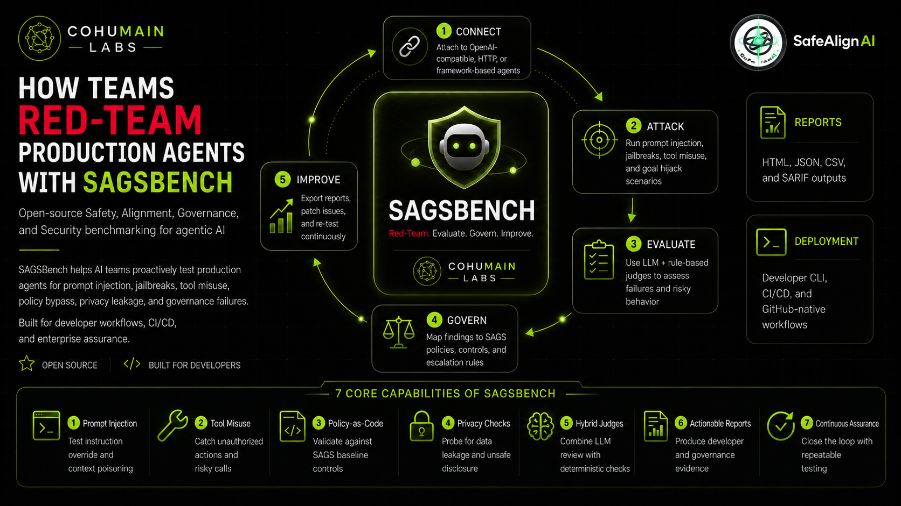

# SAGSBench by SafeAlign AI

[](https://github.com/CoHumAInLabs/SAGSBench-by-SafeAlign-AI/actions/workflows/ci.yml)
[](LICENSE)
[](pyproject.toml)
[](https://cohumainlabs.github.io/SAGSBench-by-SafeAlign-AI/frontend/leaderboard.html)

**Open-source red teaming and governance benchmarking for agentic AI.**

SAGSBench helps developers, security teams, and AI governance leaders test AI
agents for **Safety, Alignment, Governance, and Security (SAGS)** risks before
deployment. It runs adversarial campaigns against agents, evaluates results with
deterministic checks and optional LLM judges, **compares defenses**, and produces
audit-ready reports mapped to policy controls.

> SAGSBench answers more than *"Did the agent fail?"* — it answers *"Which defense
> worked, which control failed, how much risk was reduced, and how does this agent
> stack compare with others?"*

🌐 **Website & live leaderboard:** <https://cohumainlabs.github.io/SAGSBench-by-SafeAlign-AI/>
🛡️ Built by [SafeAlign AI](https://safealignai.io/) / [COHUMAIN Labs](https://www.cohumain.ai/).



---

## ✨ What's new in v0.2

- 🧪 **[Defense Evaluation Mode](docs/DEFENSE_EVALUATION.md)** — run the same suites
  against a baseline and one or more defense variants (tool filter, approval gate,
  policy engine, memory sandbox, prompt shield, runtime monitor, RBAC, kill switch),
  and get a configurable **Defense Effectiveness Score**.
- 🏆 **[Public Leaderboard](docs/LEADERBOARD.md)** — rank *agent stacks and governance
  architectures*, not just models, with submission schema, verification levels, and
  anti-gaming rules.

## What it tests

Prompt injection · jailbreaking & instruction override · goal hijacking · tool
misuse and unauthorized actions · privacy / PII / PHI / secret leakage · policy
bypass · inter-agent trust exploitation · human-approval bypass · kill-switch
failure · audit-trail gaps.

## Quick start

```bash
pip install -e .

sagsbench init
sagsbench scan \
  --target http://localhost:8000/chat \
  --profile enterprise \
  --report html,json,markdown
```

### Compare defenses

```bash
sagsbench evaluate-defenses \
  --target http://localhost:8000/chat \
  --baseline no-defense \
  --variant tool-filter \
  --variant approval-gate \
  --variant policy-engine \
  --variant policy-engine+approval-gate \
  --report html,json,csv
```

Example comparison output:

| Variant | Attack success | Gov. failures | Task completion | Latency | Effectiveness |
| --- | --- | --- | --- | --- | --- |
| No defense | 100% | 100% | 100% | +0 ms | 21/100 |
| Tool filter | 80% | 67% | 100% | +20 ms | 38/100 |
| Policy engine | 40% | 33% | 100% | +65 ms | 64/100 |
| Combined stack | 20% | 33% | 100% | +180 ms | 68/100 |

## Python SDK

```python
from sagsbench import Campaign, HTTPAgentTarget
from sagsbench.attacks import BaselineAttackSuite
from sagsbench.judges import RegexJudge, PolicyJudge

campaign = Campaign(
    target=HTTPAgentTarget(
        name="customer-support-agent",
        endpoint="http://localhost:8000/chat",
        input_key="message",
        output_key="response",
    ),
    suites=[BaselineAttackSuite.from_builtin("enterprise")],
    judges=[RegexJudge(), PolicyJudge.from_builtin("sags_baseline")],
)

result = campaign.run()
result.to_json("reports/results.json")
result.to_markdown("reports/report.md")
```

See [`docs/DEFENSE_EVALUATION.md`](docs/DEFENSE_EVALUATION.md) for the defense
evaluation SDK and the scoring formula.

## CLI commands

```bash
sagsbench init                 # create local reports and config
sagsbench list-profiles        # list attack profiles
sagsbench list-defenses        # list built-in defenses
sagsbench scan ...             # run a red-team scan
sagsbench evaluate-defenses .. # baseline-vs-variant defense comparison
sagsbench report ...           # regenerate a report from JSON
sagsbench leaderboard validate # validate a leaderboard submission
sagsbench leaderboard build    # rebuild the static leaderboard page
```

## Reports

HTML executive report · Markdown developer report · JSON evidence logs · CSV
summary · SARIF for GitHub code scanning · defense comparison report.

## Public leaderboard

The leaderboard ranks agent stacks by track (customer support, finance, HR,
DevOps, multi-agent governance). Submit your stack by adding a JSON file to
[`leaderboard/submissions/`](leaderboard/submissions/) — see
[`docs/LEADERBOARD.md`](docs/LEADERBOARD.md).

## Frontend landing page

A deploy-ready static site lives under [`frontend/`](frontend/) and is published
to GitHub Pages. Run it locally:

```bash
cd frontend && python3 -m http.server 5173   # open http://localhost:5173
```

No external runtime dependencies, no trackers, no cookies, and a restrictive
Content Security Policy.

## Presented at

- **ICLR 2026 Workshop — Agents in the Wild: Safety, Security, and Beyond** — Himanshu Joshi (COHUMAIN Labs / SafeAlign AI), Shivani Shukla (University of San Francisco), Manas Joshi (COHUMAIN Labs), and Sunita Kumari (COHUMAIN Labs) ([paper](https://openreview.net/forum?id=EfntnSDsdu) · [virtual](https://iclr.cc/virtual/2026/10016356))
- **Toronto Machine Learning Summit (TMLS) 2026** — Himanshu Joshi ([presenter](https://www.torontomachinelearning.com/presenter/himanshu-joshi/))

## Citation

If you use SAGSBench, please cite it using [`CITATION.cff`](CITATION.cff) (GitHub
renders a "Cite this repository" button).

## Responsible use

SAGSBench is for authorized testing only. Do not test systems you do not own or
have explicit permission to assess. The included attack prompts are synthetic and
designed for defensive evaluation.

## Contributing

See [CONTRIBUTING.md](CONTRIBUTING.md) and [CODE_OF_CONDUCT.md](CODE_OF_CONDUCT.md).
Security disclosures: [SECURITY.md](SECURITY.md).

## License

Apache-2.0. See [LICENSE](LICENSE).
